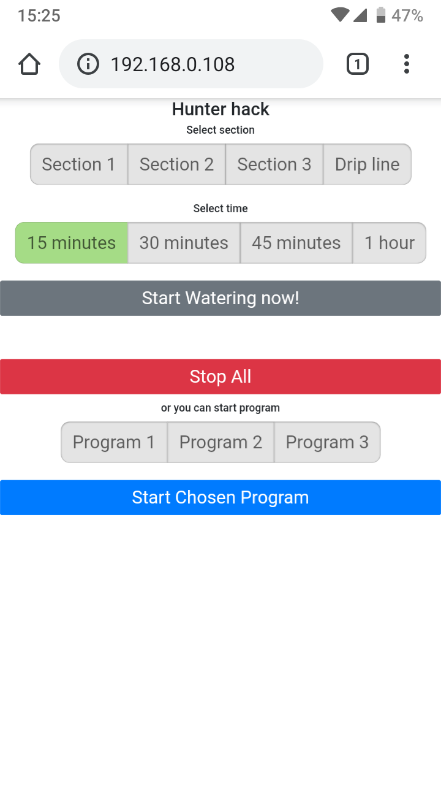

# hunter-hack

is a ESP8266 driver for hunter sprinklers system. It connects through somewhat bizarre and strange one-wire protocol.  
Connect to Hunter sprinklers driver through  
REM port -> (D0)  
AC (near REM) ->3V3
## Description

> I finally managed to get this hack to work on a D1 mini thanks to Scott and Dave inputs.

This is a [comment] for a [blog post] about controlling Hunter Sprinkler remotely.
The blog post describes how to use [Esquilo Air] board with Hunter sprinkler shield.

The shield is no longer available, but protocol was [reverse-engineered] by blog post [author].

Protocol implementation can be found in [hunter.h] and [hunter.cpp] files that can be also found in [OpenSprinkler-Firmware-Hunter] project.

## API
You can drive this device by home-assistant and curl command.
just run command:
curl http://LOCALIP/section/1/time/15 - runs section 1 for 15 minutes
curl http://LOCALIP/program/1' - runs program 1
curl http://LOCALIP/StopAll - you know what it does ;)
where LOCALIP is your ESP8266 device IP number
## Screenshot  
 

[OpenSprinkler-Firmware-Hunter]: https://github.com/seb821/OpenSprinkler-Firmware-Hunter
[hunter.h]: https://github.com/seb821/OpenSprinkler-Firmware-Hunter/blob/master/hunter.h
[hunter.cpp]: https://github.com/seb821/OpenSprinkler-Firmware-Hunter/blob/master/hunter.cpp
[blog post]: https://www.hackster.io/sshumate/hunter-sprinkler-wifi-remote-control-4ea918
[Esquilo Air]: https://eu.mouser.com/new/esquilo/esquilo-air/
[reverse-engineered]: https://www.hackster.io/sshumate/hunter-sprinkler-wifi-remote-control-4ea918#comment_11558
[author]: https://www.hackster.io/sshumate
[comment]: https://www.hackster.io/sshumate/hunter-sprinkler-wifi-remote-control-4ea918#comment_68584
